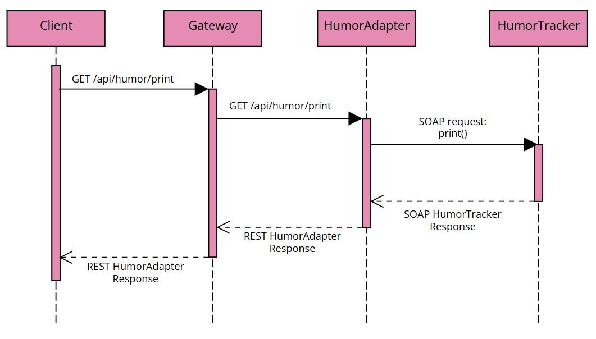

# 📌 **Tracker Application**

**Version:** 1.0  
**Last Update:** 17/07/2025

## 📖 **Introduction**
This project was developed for the *Software-Oriented Software Engineering (SOSE)* course, with the aim of exploring REST and SOAP methodologies for building web services in Java.

The application implements a system composed of independent trackers (e.g., sleep, coffee, weather) and **prosumers**, which aggregate data from these services to provide analysis and personalized advice.

The initial idea was to design a monolithic SOAP-based application. However, the architecture was later refactored into a microservices-based system, integrating RESTful services, SOAP endpoints, CXF, Spring Boot, and Spring Cloud Gateway.

At this stage, the application does not support multi-user authentication, in order to keep the service interactions simple and focused. Similarly, load balancing with Eureka was not integrated, as CXF-based services are not compatible with service discovery via Eureka.
Future improvements will include support for multi-user management and integration of service discovery and load balancing mechanisms.

## 🚀 **Installation**
### **Requirements**
The project was developed and tested on Windows, but it should run on any operating system that supports Docker or Docker Compose. However, it has not been tested on platforms other than Windows.

The requirements for running the projects are:
- Docker Desktop (recommended version 4.43.1 or higher)
- Git (optional, for cloning the project)
- Java, Maven and Tomcat are not required locally, everything is managed within Docker containers.

### **Run Application**
1. (Optional) Clone the repository or simply download and extract the archive.
```sh
# Clone the repository
git clone https://github.com/m4rylu/SOSE-Tracker-Application.git
cd SOSE-Tracker-Application
```
2. From project root run the command:
```sh
docker-compose up --build
```
3. Wait for the build to complete and for all containers to start
4. Once the application is running, services will be accessible at: http://localhost:8087

## 🧱 Architecture:
The application is based on a microservices architecture and leverages the following technologies:
- SOAP and REST services implemented in Java using Spring Boot and Apache CXF
- Spring Cloud Gateway as the centralized access and routing point
- Docker for containerization and orchestration of services

Initially, we considered developing a classical SOSE-based system, in line to Service-Oriented Architecture (SOA) principles such as:
- **Service reusability**: defining common interfaces for multiple services (e.g., a shared Tracker component to be implemented by all trackers)
- **Centralized Service Management**: Controlling service interactions and logic through a centralized orchestrator.
- **Service Coordination and Composition**: Combining and orchestrating atomic services into more complex business processes
An example of this initial architecture is shown in the diagram below.


While this approach simplified maintenance, since a single implementation could be modified to reflect changes across all services, it introduced a single point of failure: if the central tracker failed, all dependent services would be affected.

To overcome these limitations, we moved toward a**microservices-oriented architecture**, aligning with modern software engineering practices. This approach prioritizes independence, fault isolation, and service availability. Although it introduces some code duplication and slightly more complex maintenance, it brings substantial long-term benefits in terms of *scalability*, *resilience*, and *deployment flexibility*.
Key advantages of this architecture include:
- **Autonomous Services**: Each service is fully independent, with its own database, business logic, and technology stack (e.g., REST/SOAP, CXF, Spring Boot).
- **Decentralized Architecture**: There is no central orchestrator. Services can operate independently and interact directly or via intermediate components like prosumers.
- **Unified Access via Gateway**: All external communication passes through a centralized Spring Cloud Gateway, which routes requests, applies filters, and provides a unified API surface.


## 🏗 Project Structure:
```
📂 SOSE-Tracker-Application
┣ 📂 advice-coffee-service/ # REST-CXF Service Advice for Coffee&Sleep
┣ 📂 advice-mood-adapter/   # REST-Spring Adapter for Advice Mood
┣ 📂 advice-mood-service/   # SOAP-CXF Service Advice for Mood
┣ 📂 client/                # An example of client exacutable in Java
┣ 📂 coffee-service/        # REST-CXF Service Coffee Tracker
┣ 📂 data-analysis-service/ # REST-CXF Service for analyzing data
┣ 📂 gateway/               # Spring Cloud Gateway
┣ 📂 humor-adapter/         # REST-Spring Adapter for Humor Tracker
┣ 📂 humor-service/         # Documentazione
┣ 📂 rate-service/          # Documentazione
┣ 📂 sleep-adapter/         # REST-Spring Adapter for Sleep Tracker
┣ 📂 sleep-service/         # SOAP-Spring Service Sleep Tracker
┣ 📂 weather-service/       # REST-Spring Service Weather Adapter
┣ 📄 docker-compose.yml     # Define containers of services and gateway
┣ 📄 README.md              # Introductory guide 
```
## 🛠 **Services**

| Service | Endpoint | Technology | Role |
|-----------|-----------|-----------|-----------|
| CoffeeTracker | REST | CXF | Provider | 
| SleepTracker | SOAP | Spring Boot | Provider |
| RateMyDayTracker | REST| CXF | Provider |
| UmorTracker | SOAP | CXF | Provider | 
| WeatherTracker | REST | Spring Boot | Provider |
| AdviceCoffee | REST | CXF | Prosumer |
| AdviceMood | SOAP | CXF | Prosumer |
| Data Analysis | REST | CXF | Prosumer |
| Gateway | REST | Spring Cloud Gateway | Entry Point |

### **`CoffeeTrackerRESTServiceMaven` - Provider Service**
The Coffee Tracker is a Java-based web service developed using framework Apache CXF and configured via Maven for dependency management. The service provides a RESTful API exposing three operations that allow clients to interact with coffee consumption tracking functionalities that involves serialization and deserialization for storing permanently data in a single file.

It is implemented using Jakarta for RESTful Web Services and deployed through a non-Spring CXF servlet, specifically the CXFNonSpringJaxrsServlet provided by jaxrs.servlet.
This servlet is responsible for handling incoming HTTP requests and delegating them to the appropriate resource classes based on URI paths and annotations.

#### **Service Operations**
- **`printCoffeeTracker() -> String`**  
  Print a matrix that represent all coffee taken in a year:
  - rows: months (0=january, ..., 11=dicember)
  - columns: days (0=1° day, ..., 30=31° day)
- **`addCoffeeTracker(int coffee) -> String`**  
  Adds the number of coffee taken for current date, if the number is valid return a confirmation message, instead if the value is not correct it return an error message.
- **`last7DaysValues() -> String`**  
  Print the last 7 values, excluding today, saved in the tracker.

#### **Available Paths**
**Backend** (CoffeeTracker REST Service)
Base URL: `http://localhost:8080/CoffeeTrackerRESTServiceMaven/`
Available Endpoints:
- /coffee/print          Calls printCoffeeTracker() 
- /coffee/add/{value}    Calls addCoffeeTracker(value)
- /coffee/lastValues     Calls last7DaysValues()
- /coffee?_wadl           Returns the WADL XML document that describes the REST service
- /coffee/openapi.json        Return the OpenAPI/Swagger documentation in JSON format

**Gateway** (Spring Cloud Gateway)
Base URL: `http://localhost:8087/api/coffee`
Available Endpoints:
- /print          Calls printCoffeeTracker() 
- /add/{value}    Calls addCoffeeTracker(value)
- /lastValues     Calls last7DaysValues()
- /wadl           Returns the WADL XML document that describes the REST service
- /openapi        Return the OpenAPI/Swagger documentation in JSON format

#### **Sequence Diagram**
The following sequence diagram illustrates the execution flow of the *print()* operation in the Coffee Tracker service. Although this example focuses on print, the interaction flow is equivalent for the other two operations provided by the service.


### **`SleepTrackerSOAPSpringService` - Provider Service**
Sleep Tracker is a Java-based web service developed using the Spring Boot framework and exposed via SOAP interface. Like other projects the dependency management is handled using Maven and implement three methods to interact with the tracker that involves serialization for persistent data. 

This service adopts a *contract-first* approach to SOAP development. We've defined an XML schema (XSD) with the description of all service operations and message structure for the automatic generation of Java classe using the JAXB2 Maven plugin.

Since the application is built with Spring Boot, it does not rely on a traditional web.xml servlet configuration. Instead, service endpoints are exposed and managed through Spring’s configuration and controller classes.

To ensure compatibility with the REST-based communication enforced by Spring Cloud Gateway, a dedicated adapter component is implemented. This adapter receives RESTful requests , transforms them into the corresponding SOAP calls, and handles the response transformation.

Although the Gateway can technically forward raw SOAP requests directly to SOAP services, this approach limits future integration capabilities. By introducing an adapter layer, the system ensures cleaner integration, improved modularity, and greater flexibility for future enhancements, such as service discovery, load balancing, and scaling.

#### **Service Operations**
- **`printSleepTracker() -> String`**  
  Print a matrix that represent all slept hours in a year:
  - rows: months (0=january, ..., 11=dicember)
  - columns: days (0=1° day, ..., 30=31° day)
- **`addSleepTracker(int sleep) -> String`**  
  Adds the number of slept hours for current date, if the number is valid return a confirmation message, instead if the value is not correct it return an error message.
- **`last7DaysValues() -> String`**  
  Print the last 7 values, excluding today, saved in the tracker.

#### **Available Paths**
**Backend** (SleepTracker SOAP Service)
This web services exposes SOAP services, to call the operations is necessary use tool compatible with SOAP (SoapUI,Postman) or client generated from the WSDL. The only feature directly accessible from a browser is the WSDL file for service description.
Base URL: `http://localhost:8082/services`
Available Endpoints:
- /sleepTracker.wsdl         Returns the WSDL XML document that describes the REST service

**Gateway** (Spring Cloud Gateway)
Thanks to the presence of a dedicated adapter, the service can also be accessed through the REST-based Gateway.
Base URL: `http://localhost:8087/api/sleep`
Available Endpoints:
- /print          Calls printCoffeeTracker() 
- /add/{value}    Calls addCoffeeTracker(value)
- /lastValues     Calls last7DaysValues()

The Swagger UI is not accessible through the Gateway due to path rewriting limitations. To access the API documentation use:
`http://localhost:8089/swagger-ui/index.html`

#### **Sequence Diagram**
The following sequence diagram illustrates the execution flow of the *add(int i)* operation in the Sleep Tracker service and his adapter. Although this example focuses on add, the interaction flow is equivalent for the other two operations provided by the service.


### **`RateMyDayTrackerSOAPSpringService` - Provider Service**
Rate Tracker is a Java-based web service developed using framework Apache CXF and configured via Maven for dependency management. The service provides a RESTful API exposing three operations that allow clients to interact with rating days tracking functionalities that involves serialization and deserialization for storing permanently data in a single file.

It is implemented using Jakarta for RESTful Web Services and deployed through a non-Spring CXF servlet, specifically the CXFNonSpringJaxrsServlet provided by jaxrs.servlet.
This servlet is responsible for handling incoming HTTP requests and delegating them to the appropriate resource classes based on URI paths and annotations.

#### **Service Operations**
- **`printRateMyDayTracker() -> String`**  
  Print a matrix that represent the days rated in a year:
  - rows: months (0=january, ..., 11=dicember)
  - columns: days (0=1° day, ..., 30=31° day)
- **`addRateMyDayTracker(int sleep) -> String`**  
  Adds the number of rate value for current date, if the number is valid return a confirmation message, instead if the value is not correct it return an error message.
- **`last7DaysValues() -> String`**  
  Print the last 7 values, excluding today, saved in the tracker.

#### **Available Paths**
**Backend** (RateMyDayTracker REST Service)
Base URL: `http://localhost:8084/RateMyDayTrackerRESTServiceMaven`
Available Endpoints:
- /rate/print          Calls printRateMyDayTracker() 
- /rate/add/{value}    Calls addRateMyDayTracker(value)
- /rate/lastValues     Calls last7DaysValues()
- /rate?_wadl           Returns the WADL XML document that describes the REST service
- /openapi.json        Return the OpenAPI/Swagger documentation in JSON format

**Gateway** (Spring Cloud Gateway)
Base URL: `http://localhost:8087/api/rate`
Available Endpoints:
- /print          Calls printRateMyDayTracker() 
- /add/{value}    Calls addRateMyDayTracker(value)
- /lastValues     Calls last7DaysValues()
- /wadl           Returns the WADL XML document that describes the REST service
- /openapi        Return the OpenAPI/Swagger documentation in JSON format

#### **Sequence Diagram**
The following sequence diagram illustrates the execution flow of the *lastValues()* operation in the Rate My Day Tracker service and his adapter. Although this example focuses on last values, the interaction flow is equivalent for the other two operations provided by the service.


### **`UmorTrackerSOAPServiceMaven` - Provider Service**
The Umor Tracker is a Java-based web service developed using Apache CXF framework and configured with Maven for dependency management. It exposes a SOAP-based API that offers three operations related to humor/mood tracking which handles serialization and deserialization to permanently store data.

The implementation relies on Jakarta XML Web Services (JAX-WS) and is deployed using a custom servlet based on Apache CXF - CXFNonSpringServlet. This servlet, defined in the SimpleCXFNonSpring class, is responsible for publishing the SOAP endpoints and handling incoming SOAP requests, delegating them to the appropriate service classes based on the request payload.

To ensure compatibility with the REST-based communication enforced by Spring Cloud Gateway, a dedicated adapter component is implemented. This adapter receives RESTful requests , transforms them into the corresponding SOAP calls, and handles the response transformation.

Although the Gateway can technically forward raw SOAP requests directly to SOAP services, this approach limits future integration capabilities. By introducing an adapter layer, the system ensures cleaner integration, improved modularity, and greater flexibility for future enhancements, such as service discovery, load balancing, and scaling.

#### **Service Operations**
- **`printUmorTracker() -> String`**  
  Print a matrix that represent the mood values in a year:
  - rows: months (0=january, ..., 11=dicember)
  - columns: days (0=1° day, ..., 30=31° day)
- **`addUmorTracker(int sleep) -> String`**  
  Adds the mood value for current date, if the number is valid return a confirmation message, instead if the value is not correct it return an error message.
- **`last7DaysValues() -> String`**  
  Print the last 7 values, excluding today, saved in the tracker.

#### **Available Paths**
**Backend** (UmorTracker SOAP Service)
This web services exposes SOAP services, to call the operations is necessary use tool compatible with SOAP (SoapUI,Postman) or client generated from the WSDL. The only feature directly accessible from a browser is the WSDL file for service description.
Base URL: `http://localhost:8085/UmorTrackerSOAPServiceMaven`
Available Endpoints:
- /umor?wsdl       Returns the WSDL XML document that describes the REST service

**Gateway** (Spring Cloud Gateway)
Thanks to the presence of a dedicated adapter, the service can also be accessed through the REST-based Gateway.
Base URL: `http://localhost:8087/api/humor`
Available Endpoints:
- /print          Calls printUmorTracker() 
- /add/{value}    Calls addUmorTracker(value)
- /lastValues     Calls last7DaysValues()

The Swagger UI is not accessible through the Gateway due to path rewriting limitations. To access the API documentation use:
`http://localhost:8088/swagger-ui/index.html`

#### **Sequence Diagram**
The following sequence diagram illustrates the execution flow of the *print()* operation in the Humor Tracker service and his adapter. Although this example focuses on print, the interaction flow is equivalent for the other two operations provided by the service.



### **`WeatherTrackerRESTSpring` - Provider Service**
Weather Tracker is a Java-based web service developed using the Spring Boot framework and exposed via REST interface. Like other projects the dependency management is handled using Maven and implement three methods to interact with the tracker that involves serialization for persistence of data. 

Since the application is built with Spring Boot, it does not rely on a traditional web.xml servlet configuration. Instead, service endpoints are exposed and managed through Spring’s configuration and controller classes.

#### **Service Operations**
- **`printWeatherTracker() -> String`**  
  Print a matrix that represent the weathers in a year:
  - rows: months (0=january, ..., 11=dicember)
  - columns: days (0=1° day, ..., 30=31° day)
- **`addWeatherTracker(int sleep) -> String`**  
  Adds the number of weather value for current date, if the number is valid return a confirmation message, instead if the value is not correct it return an error message.
- **`last7DaysValues() -> String`**  
  Print the last 7 values, excluding today, saved in the tracker.

#### **Available Paths**
**Backend** (WeatherTracker REST Service)
Base URL: `http://localhost:8086/WeatherTrackerRESTSpring`
Available Endpoints:
- /print          Calls printWeatherTracker() 
- /add/{value}    Calls addWeatherTracker(value)
- /lastValues     Calls last7DaysValues()

`http://localhost:8086/v3/api-docs`          Return the OpenAPI/Swagger documentation in JSON format
`http://localhost:8086/swagger-ui.html`      Return the UI Swagger

**Gateway** (Spring Cloud Gateway)
Base URL: `http://localhost:8087/api/weather`
Available Endpoints:
- /print          Calls printRateMyDayTracker() 
- /add/{value}    Calls addRateMyDayTracker(value)
- /lastValues     Calls last7DaysValues()
- /openapi        Return the OpenAPI/Swagger documentation in JSON format

The Swagger UI is not accessible through the Gateway due to path rewriting limitations. To access the API documentation use:
`http://localhost:8086/swagger-ui/index.html`

#### **Sequence Diagram**
The following sequence diagram illustrates the execution flow of the *add(int i)* operation in the Sleep Tracker service and his adapter. Although this example focuses on add, the interaction flow is equivalent for the other two operations provided by the service.


### **`AdviceCoffeeRESTProsumerService` - Prosumer Service**
This service is a **prosumer** component designed to provide personalized advice to users based on their tracked data.
In this implementation, the prosumer interacts with two independent services: 
- a REST-based **Coffee Tracker**
- a SOAP-based **Sleep Tracker**

It is implemented as a **Java web service**, using the **Apache CXF** framework to handle RESTful API communication, **Jakarta EE 10** for the platform specification, and **Maven** for dependency management.

The service exposes its REST API through the `CXFNonSpringJaxrsServlet` (a non-Spring servlet provided by Apache CXF), which is configured in the `web.xml` deployment descriptor. This servlet is responsible for routing incoming HTTP requests to the appropriate resource classes based on URI patterns and JAX-RS annotations.

#### **Use of Asynchronous Communication**
Asynchronous service callback invocation was adopted in this prosumer to avoid sequential calls to the REST-based Coffee Tracker and the SOAP-based Sleep Tracker services. Although the coordination between the two asynchronous calls is still implemented using active polling (which introduces blocking), the asynchronous design allows both requests to be dispatched in parallel, thus reducing the overall response time perceived by the client.

In practice, the architecture does not depend on true non-blocking behavior, as the business logic of the platform does not require it. However, asynchronous communication has been introduced as an optimization technique to minimize waiting times, especially considering that both trackers may take several seconds to respond.

This design choice is further justified by the decision to bypass the Spring Cloud Gateway for these internal service-to-service calls. By communicating directly with the services (REST and SOAP endpoints), the application avoids additional routing and filtering layers, gaining further performance improvements and reducing the response latency.

In summary:
- The asynchronous pattern helps **avoid unnecessary sequential execution**.
- It aims to **optimize performance** by overlapping I/O wait times.
- True concurrency is not exploited, but the architecture is **ready to support it**.
- Direct communication with services further reduces delays introduced by the gateway. 

#### **Service Operations**
- **`getAdviceCoffee() -> String`**  
Provides personalized advice by aggregating data from two external services:
- a REST-based **Coffee Tracker**
- a SOAP-based **Sleep Tracker**

#### **Available Paths**
**Backend** (Advice Coffee REST Service)
Base URL: `http://localhost:8081/AdviceCoffeeRESTProsumerService/`
Available Endpoints:
- /coffeeAdvice/advice         Calls getAdviceCoffee()
- /coffeeAdvice?_wadl          Returns the WADL XML document that describes the REST service
- /coffeeAdvice/openapi.json        Return the OpenAPI/Swagger documentation in JSON format

**Gateway** (Spring Cloud Gateway)
Base URL: `http://localhost:8087/api/advice/coffee`
Available Endpoints:
- /advice         Calls getAdviceCoffee()
- /wadl           Returns the WADL XML document that describes the REST service
- /openapi        Return the OpenAPI/Swagger documentation in JSON format


#### **Sequence Diagram**
The following sequence diagram illustrates the execution flow of the *getAdviceCoffee()* operation in the Advice Coffee Service.


### **`AdviceMoodSOAPProsumerService` - Prosumer Service**
This service is a **prosumer** component designed to provide personalized advice to users based on their tracked data.
In this implementation, the prosumer interacts with two independent services: 
- a REST-based **Rate My Day Tracker**
- a SOAP-based **Umor Tracker**

It is implemented as a **Java web service**, using the **Apache CXF** framework to handle SOAP API communication, **Jakarta EE 10** for the platform specification, and **Maven** for dependency management.

The service exposes its SOAP API through a personalized version of servlet based on the `CXFNonSpringServlet` (a non-Spring servlet provided by Apache CXF), which is configured in the SimpleCXFNonSpringServlet.java and`web.xml` deployment descriptor. This servlet is responsible for publish and manage the SOAP services endpoint.

To ensure compatibility with the REST-based communication enforced by Spring Cloud Gateway, a dedicated adapter component is implemented. This adapter receives RESTful requests , transforms them into the corresponding SOAP calls, and handles the response transformation.

Although the Gateway can technically forward raw SOAP requests directly to SOAP services, this approach limits future integration capabilities. By introducing an adapter layer, the system ensures cleaner integration, improved modularity, and greater flexibility for future enhancements, such as service discovery, load balancing, and scaling.

#### **Use of Asynchronous Communication**
For this asynchronous service has been adopted the polling approach to avoid sequential calls to the REST-based Rate My Day Tracker and to the SOAP-based Umor Tracker. Although the coordination between the two asynchronous calls is still implemented using active polling (which introduces blocking), the asynchronous design allows both requests to be dispatched in parallel, thus reducing the overall response time perceived by the client.

In practice, the architecture does not depend on true non-blocking behavior, as the business logic of the platform does not require it. However, asynchronous communication has been introduced as an optimization technique to minimize waiting times, especially considering that both trackers may take several seconds to respond.

This design choice is further justified by the decision to bypass the Spring Cloud Gateway for these internal service-to-service calls. By communicating directly with the services (REST and SOAP endpoints), the application avoids additional routing and filtering layers, gaining further performance improvements and reducing the response latency.

In summary:
- The asynchronous pattern helps **avoid unnecessary sequential execution**.
- It aims to **optimize performance** by overlapping I/O wait times.
- True concurrency is not exploited, but the architecture is **ready to support it**.
- Direct communication with services further reduces delays introduced by the gateway. 

#### **Service Operations**
- **`adviceMood() -> String`**  
Provides personalized advice by aggregating data from two external services:
- a REST-based **Coffee Tracker**
- a SOAP-based **Sleep Tracker**

#### **Available Paths**
**Backend** (AdviceMood SOAP Service)
This web services exposes SOAP services, to call the operations is necessary use tool compatible with SOAP (SoapUI,Postman) or client generated from the WSDL. The only feature directly accessible from a browser is the WSDL file for service description.
Base URL: `http://localhost:8083/AdviceMoodSOAPProsumerServiceMaven`
Available Endpoints:
- /moodAdvice?wsdl           Returns the WSDL XML document that describes the REST service

**Gateway** (Spring Cloud Gateway)
Thanks to the presence of a dedicated adapter, the service can also be accessed through the REST-based Gateway.
Base URL: `http://localhost:8087/api/advice/mood`
Available Endpoints:
- /advice         Calls adviceMood()

The Swagger UI is not accessible through the Gateway due to path rewriting limitations. To access the API documentation use:
`http://localhost:8090/swagger-ui/index.html`

#### **Sequence Diagram**
The following sequence diagram illustrates the execution flow of the *getAdviceCoffee()* operation in the Advice Coffee Service and his Adapter.


### **`DataAnalysisRESTProsumerService` - Prosumer Service**
This service acts as a **prosumer** component that performs lightweight data analysis on a selected tracker that includes basic statistical metrics, mean, sum, maximum, and minimum calculated over the last 7 days of recorded data (excluding the current day). While the logic is shared across methods, the service dynamically chooses between three different trackers based on the user’s request:
- a REST-based **Coffee Tracker**
- a SOAP-based **Mood Tracker**
- a SOAP-based **Sleep Tracker**

The application is implemented as a **Java web service**, leveraging the **Apache CXF** framework for handling RESTful communication, **Jakarta EE 10** as the platform specification, and **Maven** for managing project dependencies.

The REST API is exposed using the CXFNonSpringJaxrsServlet, a servlet provided by Apache CXF for non-Spring environments. This servlet is defined in the web.xml deployment descriptor and is responsible for dispatching HTTP requests to the correct JAX-RS resource classes based on URI patterns and annotations.

#### **Service Operations**
- **`getCoffeeData() -> String`**  
Returns a lightweight analysis on the:
- REST-based **Coffee Tracker**
- **`getSleepData() -> String`**  
Returns a lightweight analysis on the:
- SOAP-based **Sleep Tracker**
- **`getHumorData() -> String`**  
Returns a lightweight analysis on the:
- SOAP-based **Humor Tracker**

#### **Available Paths**
**Backend** (Data Analysis REST Service)
Base URL: `http://localhost:8091/DataAnalysisRESTProsumerService`
Available Endpoints:
- /DataAnalysis/coffeeData     Calls getCoffeeData()
- /DataAnalysis/sleepData      Calls getSleepData()
- /DataAnalysis/humorData      Calls getHumorData()
- /DataAnalysis?_wadl           Returns the WADL XML document that describes the REST service
- /DataAnalysis/openapi.json        Return the OpenAPI/Swagger documentation in JSON format

**Gateway** (Spring Cloud Gateway)
Base URL: `http://localhost:8087/api/data/analysis`
Available Endpoints:
- /coffeeData     Calls getCoffeeData()
- /sleepData      Calls getSleepData()
- /humorData      Calls getHumorData()
- /wadl           Returns the WADL XML document that describes the REST service
- /openapi        Return the OpenAPI/Swagger documentation in JSON format

#### **Sequence Diagram**
The following sequence diagram illustrates the execution flow of the *getSleepData()* operation in the Data Analysis Service. Although this example focuses on the Sleep Tracker, the interaction flow of **getHumorData()* is equivalent to the *getSleepData()* operation


#### **Use of Asynchronous Communication**
The service incorporates asynchronous communication when interacting with the tracker services. It utilizes the asynchronous versions of the methods (for SOAP) or sends asynchronous HTTP requests (for REST) to initiate non-blocking calls that return immediately with a future-like response.

While waiting (polling) for the remote operation to complete, the method performs parallel local processing, specifically it creates a serializable .ser file intended to store the analysis results. This approach allows the service to make productive use of otherwise idle time rather than simply blocking for the remote response.

Once the response from the tracker arrives, the data is parsed, analyzed, written to the file and returned from the method.

## 🌐 **Gateway**
### **Introduction**
Spring Cloud Gateway is a reactive API gateway that serves as a **single entry point** for routing request to various microservices. 

Beyond routing it can also handle load balancing, path rewriting and rate limiting, however we chose **not to implement** these additional feature. The main reason is to avoid "distorting" the original structure and purpose of the application, which is intended to demonstrate the interaction between SOAP and REST web services based on CXF servlets. These technologies are not fully compatible with tools like Eureka (used for service discovery and load balancing), and integrating them would have required significant changes to the application architecture.

To avoid the overhead of launching each microservice manually we implemented Spring Cloud Gateway and used Docker Compose to orchestrate the startup and path rewriting of all services.

### **Copying the JAR/WAR**
Instead of fully containerizing each service, we chose a simplified approach: manually copying the compiled WAR or JAR file into the relevant Docker project directory. While this isn’t fully automated, it works well for our purposes and keeps the setup relatively lightweight.
When changes are made to the source code, the project must be recompiled in the project folder using the command:
`mvn clean package javadoc:javadoc -DskipTests`
This command:
- clean and rebuilds the project
- skip the test phase (as tests have been not implemented)
- generates the *target* folder containing the executable JAR/WAR
- produces JavaDoc documentation, located in <>

After that we simply copy the WAR/JAR from the *target* folder of the project into the corresponding Docker project directory.

### **docker-compose files**
We rely on two main configuration files to run the entire project:
- `application.yml` (**in the Gateway project**) - This file is responsible for mapping and rewriting the routes of all backend services. It defines the path logic and how requests are forwarded to the correct microservices through Spring Cloud Gateway.

- `docker-compose.yml` (**at the root of the project**) – This file orchestrates the startup of the entire microservices architecture. It builds and launches each service by referencing the corresponding Dockerfile in each subdirectory, manages container networking, and ensures that all services can communicate properly via Docker's internal network.

#### **application.yml**
In the application.yml file of the Spring Cloud Gateway, we define the server port 8087 through which the gateway will be accessible. We also configure route mappings for the backend services using predicates and filters, which allow us to define path-based routing and rewrite request paths accordingly.

Here’s an example route definition for the Coffee Service. Any incoming request to the gateway starting with /api/coffee/** will be forwarded to the corresponding service running in a Docker container named *coffee-service* created by the *docker-compose.yml*. So the initial request `http://localhost:8087/api/coffee/print` will be rewrited and sent to `coffee-service:8080/CoffeeTrackerRESTServiceMaven/coffee/print`.

 ```yaml
- id: coffee # unique name for the route
  uri: http://coffee-service:8080 # destination URI for the service, using the Docker service name
  predicates: # defines when this route should be applied
  - Path=/api/coffee/**  
  filters: # rewrite parts of the request path before forwarding them to the target service.
  - RewritePath=/api/coffee/wadl, /CoffeeTrackerRESTServiceMaven/coffee?_wadl
  - RewritePath=/api/coffee/openapi, /CoffeeTrackerRESTServiceMaven/coffee/openapi.json
  - RewritePath=/api/coffee/(?<segment>.*), /CoffeeTrackerRESTServiceMaven/coffee/${segment}
  ```

#### **docker-compose.yml**
This file, as already mentioned in the introduction, is responsible for starting the Docker application, creating all service containers, and running them according to their respective Dockerfile.
Here is an example of how one service (the Coffee Service) is defined:

 ```yaml
coffee-service:
  build: ./coffee-service # builds the image using the Dockerfile in the coffee-service folder
  container_name: coffee-service # set the container name
  volumes:
    - ./coffee-service/data:/usr/local/tomcat/webapps/data # mounts a data folder inside the container
  ports:
    - "8080:8080" # maps container port 8080 to host port 8080
 ```

### **Running the services**
In base al tipo di servizio che deve essere eseguito abbiamo creato due tipologie principali di Dockerfile principali, ovvero il Dockerfile per applicazioni CXF e per Spring Boot, rispettivamente WAR e JAR

#### **WAR Deployment with Apache Tomcat**
For applications developed using **Apache CXF**, it's necessary to run them in a servlet container, since the server cannot be embedded directly within the class.
We chose Apache Tomcat v11 as the external server for this purpose.

To deploy the application, we used a custom Dockerfile that performs the following steps:

```dockerfile
# Use Tomcat 11 with Java 21
FROM tomcat:11-jdk21

# Use custom server configuration
COPY server.xml /usr/local/tomcat/conf/server.xml

# Expose the application port
EXPOSE 8085

# Remove default ROOT application
RUN rm -rf /usr/local/tomcat/webapps/*

# Copy the WAR file into the webapps folder
COPY target/UmorTrackerSOAPServiceMaven.war /usr/local/tomcat/webapps/UmorTrackerSOAPServiceMaven.war

# Copy the data folder into the container
COPY data /usr/local/tomcat/webapps/data
```

#### **JAR Deployment with Spring Boot** 
For applications developed with Spring Boot deployment is simpler, since Spring Boot includes an embedded servlet container we just need to run the generated .jar file directly.

Below is the Dockerfile used to containerize and run the Spring Boot–based microservice:

```dockerfile
# Use the official Eclipse Temurin image with Java 21 JDK
FROM eclipse-temurin:21-jdk

# Set the working directory inside the container
WORKDIR /app

# Copy the compiled JAR file into the container
COPY target/WeatherTrackerRESTSpring-0.0.1-SNAPSHOT.jar WeatherTrackerRESTSpring-0.0.1-SNAPSHOT.jar

# Copy the data folder into the container
COPY data data

# Expose port 8086 to allow external access
EXPOSE 8086

# Run the application using the java -jar command after the build of container
CMD ["java", "-jar", "WeatherTrackerRESTSpring-0.0.1-SNAPSHOT.jar"]
```
### **Run the Gateway**
To run the entire application, simply navigate to the root directory of the project (Microservice-application or docker-project) and execute the following command:
`docker-compose up --build`

This command will:
- Build all necessary Docker images using the Dockerfiles provided in each service folder
- Create and start the containers defined in the docker-compose.yml
- Set up networking between services
- Make the Spring Cloud Gateway available as the central access point

Once the containers are up and running, you will be able to access:
- The Gateway endpoints (e.g., http://localhost:8087/api/...)
- The backend microservices via the rewritten paths configured in the application.yml of the gateway

## 📚 **Documentation**
You can find the list of WADL files for the REST applications and WSDL files for the SOAP services inside the *wsdl-wadl-openAPI* folder.
For Spring-based REST applications, WADL support is deprecated, so we have instead included their corresponding OpenAPI .json specification files.

In addition to the in-code Javadoc comments, the Javadoc documentation for each service can be found at: *<service-name>/target/site/apidocs/index.html*

## 👤 **Authors and Contacts**
👨‍💻 **Developed by:**  Nour Al-Bustani, Maria Alberta Caradio, Ramah Juha
📧 **Email:** nour.albustani@student.univaq.it, mariaalberta.caradio@student.univaq.it, ramah.juha@student.univaq.it
🔗 **GitHub:** [(https://github.com/m4rylu/SOSE-Tracker-Application.git)]  

📌 *Ultimo aggiornamento: [17/07/2025]*